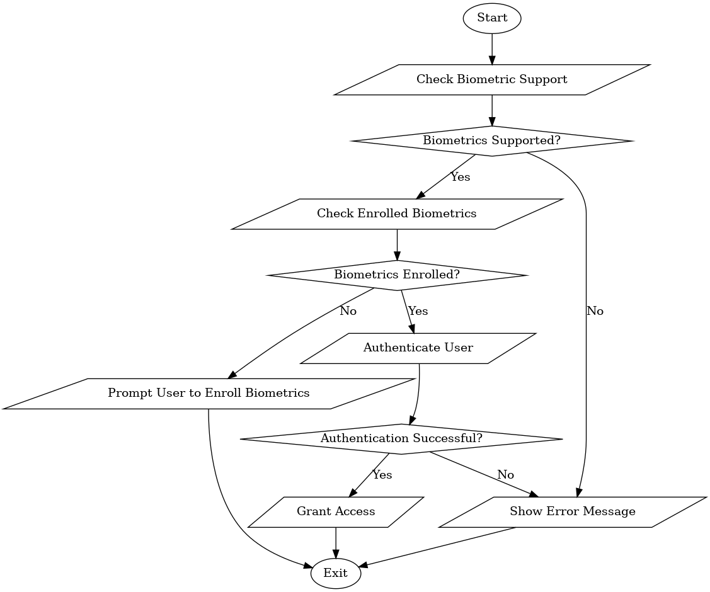

# biometric_example

A new Flutter project.

## Getting Started

# Biometric Authentication using local_auth

This guide explains how to implement biometric authentication in your Flutter application using the `local_auth` package.

## Installation

Add the `local_auth` package to your `pubspec.yaml`:

```yaml
dependencies:
  flutter:
    sdk: flutter
  local_auth: latest_version
```

Run:
```sh
flutter pub get
```

## Steps for Implementation

### 1. Check Device Capabilities
To check whether biometric authentication is available on the device:

```dart
import 'package:local_auth/local_auth.dart';

final LocalAuthentication auth = LocalAuthentication();

Future<bool> checkBiometricSupport() async {
  final bool canAuthenticateWithBiometrics = await auth.canCheckBiometrics;
  final bool canAuthenticate =
      canAuthenticateWithBiometrics || await auth.isDeviceSupported();
  return canAuthenticate;
}
```

### 2. Check Enrolled Biometrics
To get a list of enrolled biometric types:

```dart
final List<BiometricType> availableBiometrics = await auth.getAvailableBiometrics();

if (availableBiometrics.isNotEmpty) {
  // Some biometrics are enrolled.
}
```

### 3. Authenticate Using Biometrics

```dart
try {
  final bool didAuthenticate = await auth.authenticate(
    localizedReason: 'Please authenticate to proceed',
    options: const AuthenticationOptions(biometricOnly: true),
  );
} on PlatformException {
  // Handle authentication failure
}
```

### 4. Handling Errors and Custom Dialogs
You can disable default error dialogs and handle errors manually:

```dart
import 'package:local_auth/error_codes.dart' as auth_error;

try {
  final bool didAuthenticate = await auth.authenticate(
    localizedReason: 'Authenticate to continue',
    options: const AuthenticationOptions(useErrorDialogs: false),
  );
} on PlatformException catch (e) {
  if (e.code == auth_error.notAvailable) {
    // No biometric hardware available
  } else if (e.code == auth_error.notEnrolled) {
    // No biometrics enrolled
  }
}
```

To customize authentication messages:

```dart
import 'package:local_auth_android/local_auth_android.dart';
import 'package:local_auth_darwin/local_auth_darwin.dart';

final bool didAuthenticate = await auth.authenticate(
  localizedReason: 'Authenticate to proceed',
  authMessages: const <AuthMessages>[
    AndroidAuthMessages(
      signInTitle: 'Biometric Login Required',
      cancelButton: 'Cancel',
    ),
    IOSAuthMessages(
      cancelButton: 'Cancel',
    ),
  ],
);
```

## Platform-Specific Setup

### iOS
Add the following to your `Info.plist`:

```xml
<key>NSFaceIDUsageDescription</key>
<string>Why is my app authenticating using Face ID?</string>
```

### Android

#### Permissions
Add the following permission to `AndroidManifest.xml`:

```xml
<uses-permission android:name="android.permission.USE_BIOMETRIC"/>
```

#### Activity Changes
Ensure your `MainActivity` extends `FlutterFragmentActivity`:

**Java:**
```java
import io.flutter.embedding.android.FlutterFragmentActivity;

public class MainActivity extends FlutterFragmentActivity {
}
```

**Kotlin:**
```kotlin
import io.flutter.embedding.android.FlutterFragmentActivity

class MainActivity: FlutterFragmentActivity() {
}
```


## Flowchart




## Summary
- Install `local_auth`
- Check for device biometric support
- Retrieve enrolled biometric types
- Implement authentication with error handling
- Configure platform-specific settings

By following these steps, you can successfully integrate biometric authentication in your Flutter app.

